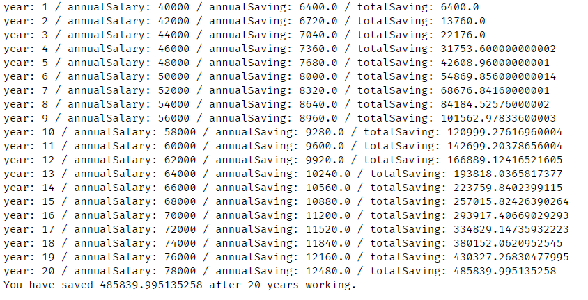

# calculate-your-net-worth

This Python-based program allows you to calculate your net worth after certain years of saving and (compound) investing with several parameters:
- annualSalary
- tax
- super/superannuation contribution percentage
- annualSalaryIncrease
- annualROI
- timeWorking

## Output

